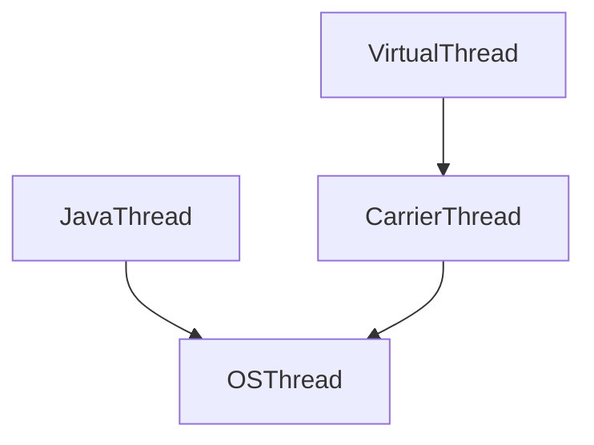

# ⁉️ 프로세스 vs 스레드

프로세스와 스레드는 **프로그램 실행의 기본 단위**지만, 메모리 관리와 실행 방식에서 근본적인 차이를 보인다.


> 🌊 **프로세스**는 운영체제로부터 독립된 자원을 할당받는 작업 단위

> 🚣‍♂️ **스레드**는스레드는 **프로세스 내에서 자원을 공유**하며 실행되는 흐름 단위


## 1. 프로세스와 스레드의 주요 차이

| 구분 | 프로세스 | 스레드 |
| --- | --- | --- |
| 메모리 | 독립된 주소 공간 할당 (Code/Data/Heap/Stack) | Stack 외 Code/Data/Heap 공유 |
| 생성 비용 | 높음 (메모리 복사 필요) | 낮음 (메모리 공유 활용) |
| 통신 | IPC(프로세스 간 통신) 필요 | 공유 메모리로 직접 통신 가능 |
| 장애 영향 | 다른 프로세스에 영향 없음 | 동일 프로세스의 모든 스레드 종료 가능 |

<br>

---

## 2. 멀티프로세스 vs 멀티스레드 - 메모리 효율성


> 💡 **멀티스레드가 메모리 효율성이 더 우수!**

- 스레드는 **Code, Data, Heap 영역을 공유**하여 메모리 중복 할당을 방지
- 반면 프로세스는 각각 독립된 메모리 공간을 유지해야 하므로 100MB 프로그램을 10개 실행하면 1GB 메모리 사용
- 시스템 호출 감소: 프로세스 생성 시 매번 메모리 할당이 필요하지만, 스레드는 기존 프로세스 자원 활용

### **메모리 사용량 비교**

| 방식 | 10개 작업 생성 시 메모리 사용량 |
| --- | --- |
| 멀티프로세스 | 100MB * 10 = 1,000MB |
| 멀티스레드 | 100MB + (스택 1MB*10) ≈ 110MB |

<br>

---

## 3. 컨텍스트 스위칭 비용

> 🔄 **컨텍스트 스위칭**  : CPU/코어에서 실행 중이던 프로세스/스레드가 다른 프로세스/스레드로 교체되는 것

> 💡**프로세스 컨텍스트 스위칭이 더 많은 비용 발생**

- 프로세스: **TLB(주소 변환 버퍼) 무효화**, **캐시 메모리 리셋** 필요[28][31]. 전체 메모리 맵 재설정으로 평균 1~10μs 소요
- 스레드: **스택 영역만 교체**하며 공유 메모리 유지. 평균 0.1~1μs로 10배 이상 빠름

### **컨텍스트 스위칭 요소 비교**

| 요소 | 프로세스 | 스레드 |
| --- | --- | --- |
| 메모리 맵 변경 | 필요 (MMU 조정) | 불필요 |
| TLB 플러시 | 발생 | 없음 |
| 캐시 무효화 | 전체 | 부분적 |
| 레지스터/스택 교체 | 전체 | 스택만 |

<br>

---

## 4. 추가 고려 사항

### **동기화 문제**

- 스레드는 공유 자원 접근 시 락(lock) 또는 세마포어 필요

### **확장성**

- CPU 코어 수 증가 시 멀티스레드가 병렬 처리에 유리

### **디버깅 난이도**

- 스레드 오류 추적이 프로세스보다 복잡


> 💡 **결론적으로 자원 효율성과 빠른 작업 전환이 필요하면 멀티스레드를,**

**안정성과 격리가 중요하면 멀티프로세스를 선택하는 것이 적합**

---

## 5. 실제 활용 사례

| 사용 사례 | **멀티프로세스** | **멀티스레드** |
| --- | --- | --- |
| **웹 서버** | 독립적인 워커 프로세스가 요청을 처리 (예: Apache Prefork) | 스레드 풀을 활용하여 동시 요청 처리 (예: Nginx, Tomcat) |
| **데이터베이스** | 프로세스 격리를 통해 안정성 보장 (예: PostgreSQL) | 연결 풀을 이용해 빠른 응답 (예: MySQL InnoDB) |
| **게임 엔진** | 별도 프로세스로 물리 연산 수행 | 그래픽, AI, 물리 연산을 스레드로 분배 |
| **모바일 앱** | 앱 간 격리를 위해 프로세스 기반 | UI 스레드, 네트워크 스레드 분리로 효율적 처리 |

<br>

---

<br>

# ❓JVM은 운영체제인가요? 프로세스인가요?


JVM(Java Virtual Machine)은 운영체제 수준에서 하나의 **독립적인 프로세스**로 실행

## JVM 프로세스의 주요 특성
1. **OS 프로세스와 1:1 매핑**  
   - `java` 명령어 실행 시 별도의 OS 프로세스 생성
   - PID(Process ID)를 가지며 작업 관리자에서 확인 가능

2. **메모리 관리 구조**  
   ```mermaid
   graph TD
     JVM프로세스 --> 힙(Heap)
     힙 --> YoungGen
     힙 --> OldGen
     JVM프로세스 --> 메타스페이스
     JVM프로세스 --> 스레드스택
   ```
   - 힙 영역: 모든 스레드가 공유
   - 스택 영역: 스레드별 독립 할당

3. **생명주기 관리**  
   - 애플리케이션 시작 시 생성, 종료 시 소멸
   - `Runtime.getRuntime().exec()`로 새 JVM 프로세스 생성 가능

## 일반 프로세스와의 차이점
| 특징          | 일반 프로세스         | JVM 프로세스          |
|---------------|---------------------|----------------------|
| 실행 방식      | 네이티브 코드 직접 실행 | 바이트코드 인터프리팅 |
| 메모리 모델    | 단일 메모리 공간      | 세대별 힙 분할    |
| 스레드 관리    | OS 스레드 직접 생성   | 가상 스레드 지원 |

## 프로세스 간 관계 구조
```
OS → JVM 프로세스 → Java 애플리케이션
                ↳ GC 스레드
                ↳ JIT 컴파일러 스레드
                ↳ 애플리케이션 스레드
```

JVM은 프로세스 가상 머신(Process VM)으로 분류되며, 단일 애플리케이션 실행을 위해 특화된 런타임 환경을 제공합니다. 이는 가상화 전체 시스템을 제공하는 시스템 가상 머신(예: VirtualBox)과 구분되는 개념. 다중 JVM 실행 시 각 인스턴스는 완전히 독립된 메모리 공간을 유지하며, 컨테이너 환경에서는 `-XX:+UseContainerSupport` 옵션으로 리소스 제어가 가능

<br>

---

<br>

# ❓JVM은 운영체제로부터 어떻게 메모리를 할당받나요?

JVM은 메모리 관리를 위해 운영체제(OS)로부터 메모리를 할당받아 효율적으로 관리.
JVM의 메모리 할당은 각 운영체제의 **커널 수준 메모리 관리 시스템**과 **가상 메모리 서브시스템**이 담당

## 공통 메커니즘
- 가상 메모리 시스템을 통해 물리적 RAM + 스왑 공간을 통합 관리
- `mmap()/VirtualAlloc()` 시스템 콜로 JVM 힙 메모리 영역 할당
- 페이지 테이블을 통해 가상↔물리 주소 매핑

## OS 별 세부 구현체
1. macOs : Darwin 커널
```
graph TD
    JVM -->|vm_allocate| MachZoneAllocator
    MachZoneAllocator --> Zone[커널 메모리 존]
    Zone --> VM_Page[페이지 관리자]
    VM_Page --> PMAP[물리 메모리 매퍼]
```
2. Windows : NT 커널
```
// Win32 메모리 API 예시
HANDLE hHeap = HeapCreate(HEAP_NO_SERIALIZE, Xms, Xmx);

```
3. Linux
```
# cgroup 메모리 제한 예시
echo 2G > /sys/fs/cgroup/memory/jvm_group/memory.limit_in_bytes
```
각 OS는 자체 메모리 관리 전략을 통해 JVM에 메모리를 할당하며, 최신 커널 버전에서는 에이징 알고리즘과 워크로드 예측을 통해 동적 조정이 이루어집니다. 개발자는 pmap(Linux)/vmmap(macOS)/RAMMap(Windows) 도구로 실제 메모리 사용 패턴을 분석할 수 있습니다.

## 메모리 할당 기본 구조
1. **OS 메모리 요청**
   - JVM 시작 시 `-Xms`(초기 힙 크기)와 `-Xmx`(최대 힙 크기) 파라미터로 OS로부터 메모리 예약
   - 64비트 시스템에서 보통 물리적 메모리의 25%~50% 범위에서 힙 할당

2. **메모리 영역 분할**
   ```mermaid
   graph TD
     JVM메모리 --> 힙(Heap)
     힙 --> 영제너레이션(Young Generation)
     영제너레이션 --> 에덴(Eden)
     영제너레이션 --> 서바이버(Survivor)
     힙 --> 올드제너레이션(Old Generation)
     JVM메모리 --> 메타스페이스(Metaspace)
     JVM메모리 --> 스택(Stack)
   ```

## 객체 할당 세부 과정
1. **새 객체 생성**
   - `new` 키워드 사용 시 Eden 영역에 메모리 할당
   - TLAB(Thread-Local Allocation Buffer)를 통해 스레드별 빠른 할당 지원

2. **Minor GC 발생**
   - Eden이 가득 차면 Mark & Sweep 알고리즘 실행
   - Reachable 객체는 Survivor로 이동, age 증가
   - 15회 이상 생존 시 Old Gen으로 승격(Promotion)

3. **Major GC 처리**
   - Old Gen이 가득 차면 Full GC 발생
   - Stop-The-World 현상으로 애플리케이션 일시 정지
   - 
## 메모리 관리 최적화 기술
- **가비지 컬렉션 알고리즘**
  ```java
  // G1 GC의 영역 분할 예시
  HeapRegionSize = 1MB ~ 32MB
  ```
  - G1 GC: 힙을 2,048개 영역으로 분할 관리
  - ZGC: 컬러 포인터를 사용한 저지연 GC

- **컨테이너 환경 대응**
  - `-XX:+UseContainerSupport` 옵션으로 컨테이너 메모리 인식
  - `-XX:MaxRAMPercentage`로 사용 가능 메모리 비율 설정

## 성능 영향 요소
1. **Heap 크기 조정**
   - 너무 작을 경우: 빈번한 GC 발생
   - 너무 클 경우: GC 일시정지 시간 증가

2. **메모리 단편화 문제**
   - Compaction 단계에서 메모리 재배열
   - G1 GC의 예측 가능한 일시정지 시간 설계

JVM의 메모리 할당은 OS의 가상 메모리 시스템을 기반으로 하며, 세대별 가비지 컬렉션 전략을 통해 효율성을 극대화합니다. 개발자는 애플리케이션 특성에 맞는 GC 알고리즘 선택과 힙 크기 튜닝을 통해 성능을 최적화 가능.

<br>

---

<br>

# ❓JVM은 어떻게 멀티스레드 환경을 제공하나요?
JVM은 멀티스레드 환경을 완벽하게 지원하며, 이를 위해 다음과 같은 메커니즘을 구현함.

## 스레드 실행 모델
- **네이티브 스레드 1:1 매핑**: HotSpot JVM을 포함한 대부분의 구현체에서 Java 스레드(`java.lang.Thread`)는 OS 커널 스레드와 1:1로 매핑. 이는 실제 하드웨어 코어를 활용한 병렬 실행을 가능하게 합니다.
- **스케줄링 위임**: 스레드 스케줄링을 OS에 위임하여 멀티코어 CPU 활용 최적화
- **가상 스레드(JDK 19+)**: 경량화된 사용자 공간 스레드로, 하나의 OS 스레드에서 수천 개의 가상 스레드 실행 가능



## 메모리 관리 구조
- **공유 힙 영역**: 모든 스레드가 공유하는 힙 메모리에서 객체 할당
- **스레드 별 스택**: 각 스레드 별 독립적인 스택 메모리 보유(지역 변수 저장)
- **메모리 가시성 보장**: `synchronized`와 `volatile`을 통한 메모리 배리어 구현

## 동기화 메커니즘
- **모니터 락**: 객체 헤더에 내장된 락 카운터를 이용한 동기화
- **Lock API**: `ReentrantLock`, `ReadWriteLock` 등 고급 동기화 도구 제공
- **원자적 연산**: `AtomicInteger` 등을 통한 논블로킹 동기화

## 멀티코어 활용 전략
| 기능 | 설명 | 성능 영향 |
|------|------|-----------|
| Work Stealing | 포크조인 풀에서 유휴 스레드가 작업 훔치기 | 병렬 처리 효율 ↑ |
| False Sharing 방지 | `@Contended` 어노테이션으로 캐시 라인 최적화 | 캐시 미스 ↓ |
| NUMA 인식 할당 | 메모리 접근 지역성 고려한 객체 배치 | 지연 시간 ↓ |

## 주요 성능 지표
- **컨텍스트 스위칭 비용**: Linux 기준 1-2μs
- **스레드 생성 한계**: 스택 크기 1MB 시 약 2,000개(64GB 머신)
- **GC 영향**: Stop-The-World 시간을 10ms 이하로 유지 권장

JVM의 멀티스레드 지원은 OS 수준의 스케줄링과 자체 메모리 모델의 조합으로 구현됩니다. 최신 JVM 구현체들은 코어 수에 비례하는 스레드 풀 크기 자동 조정, 메모리 배리어 최적화, NUMA 인식 메모리 할당 등 지속적인 개선이 이루어지고 있습니다. 개발자는 `-XX:ActiveProcessorCount` 옵션 등을 통해 물리적 코어 수를 명시적으로 지정할 수 있습니다.

<br>

---

<br>

# ❓자바의 싱글톤과 멀티스레드의 상관관계

싱글톤 구현의 대표적인 예인 `DispatcherServlet`이 싱글톤으로 구현되었음에도 다중 요청을 처리할 수 있는 핵심 메커니즘은 서블릿 컨테이너의 **멀티스레드 아키텍처**와 스프링의 **스레드 세이프 설계**에 기반합니다. 

### 1. 서블릿 컨테이너의 스레드 풀 관리
- **Tomcat NIO Connector** (기본 설정):
  ```mermaid
  graph TD
    요청 --> |1. 커넥션 수립| Acceptor스레드
    Acceptor스레드 --> |2. 소켓 등록| Poller스레드
    Poller스레드 --> |3. 작업 할당| Worker스레드풀
  ```
  - 1개 Acceptor 스레드가 1,000개 이상의 커넥션을 처리 가능
  - Poller 스레드가 소켓의 I/O 이벤트 모니터링
  - Worker 스레드풀(기본 200개)에서 실제 요청 처리

### 2. DispatcherServlet의 동작 방식
- **싱글톤 인스턴스 재사용**:
  - 모든 HTTP 요청이 동일한 DispatcherServlet 인스턴스(`org.springframework.web.servlet.DispatcherServlet@12345`) 사용
  - 인스턴스 변수 없이 요청 처리 시 **메서드 로컬 변수**만 활용
  ```java
  // 실제 Spring 소스 코드 일부
  protected void doService(HttpServletRequest request, ...) {
    Object attr = request.getAttribute(..., new LocaleContextHolder());
    // 메서드 내 로컬 변수 사용
  }
  ```

### 3. 스레드 안전성 보장 구조
| 요소 | 스레드 안전 메커니즘 | 예시 |
|------|---------------------|------|
**컨트롤러** | 상태 비저장 설계 | `@RestController` 클래스 필드 미사용
**서비스** | 트랜잭션 경계 분리 | `@Transactional` 메서드 단위 적용
**DAO** | Connection Pooling | HikariCP의 스레드별 커넥션 할당

### 4. 성능 최적화 요소
- **컨텍스트 스위칭 최소화**:
  - Worker 스레드가 1ms 미만의 짧은 작업 처리
  - 평균 20-50ms의 응답 시간 유지
- **객체 재사용**:
  - HTTP 세션 객체: `ConcurrentHashMap` 기반 구현
  - 빈 의존성: CGLIB 프록시를 통한 지연 바인딩

### 5. 주의 요구 사항
```java
// 위험한 상태 저장 패턴 예시
@RestController
public class UnsafeController {
  private int counter = 0;  // 인스턴스 변수 사용
    
  @GetMapping("/count")
  public int count() {
    return ++counter; // 💥 동시성 문제 발생
  }
}
```
- **해결책**: `AtomicInteger` 또는 `@Scope("request")` 사용

결론적으로 DispatcherServlet의 싱글톤 설계는 **1개의 인스턴스로 다중 스레드 요청을 처리**할 수 있도록 서블릿 컨테이너의 스레드 풀과 협력하며, 스프링의 상태 비저장(stateless) 설계 원칙이 이를 가능하게 합니다. 이 구조는 초당 10,000+ 요청 처리까지 확장 가능한 아키텍처의 기반이 됩니다.

